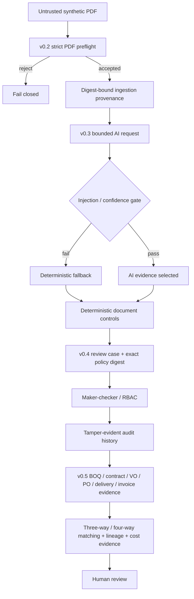

# StructuraX

[](https://github.com/bilgekayali/structurax/actions/workflows/ci.yml)


[](LICENSE)
[](DATA_LICENSE.md)

StructuraX is an open-source foundation for trustworthy, AI-assisted construction-document workflows. It combines deterministic document controls, bounded AI evidence, human review governance and construction-commercial intelligence without granting autonomous payment, procurement or deployment authority.

**1.0.0 package baseline:** package metadata is now `1.0.0`. This is not a formal production-readiness claim. Genuine independent security review, signed production-control evidence, repository-governance verification, final release SBOM/provenance attestation and human release approval remain required before `Production/Stable`, tagging or publication are treated as formally promoted.

**v0.5** added a strict construction-intelligence layer for BOQ reconciliation, contract and approved variation authority, three-way/four-way matching, supplier historical-median signals, project-cost variance evidence and typed document lineage.

> [!IMPORTANT]
> Every committed document, model response, commercial record and review artifact is synthetic/reference-only. StructuraX performs no live OCR/model call, payment, ERP mutation, procurement commitment, deployment, external notification or autonomous approval. `matched`, `review` and `block` are evidence classifications for human review, not operational decisions.

## Trust flow



## Deterministic controls through v0.5

| Area | Example signal |
|---|---|
| Arithmetic | Quantity × unit price, subtotal, tax or total does not reconcile |
| Currency | Invoice currency differs from purchase order |
| Price variance | Invoice unit price exceeds configured tolerance |
| Delivery reconciliation | Billed quantity exceeds recorded delivery |
| Payment-detail integrity | Invoice bank account differs from approved baseline |
| Duplicate detection | Supplier/reference/currency/total tuple repeats |
| Approval governance | Required high-value approval role is missing |
| Document-content security | Embedded control-bypass instruction appears in text |
| BOQ reconciliation | Authorized contract/variation quantity exceeds BOQ baseline |
| Contract authority | Invoice quantity/rate exceeds contract plus effective approved VO authority |
| Three-way matching | Invoice does not reconcile to PO and delivery quantities |
| Four-way matching | Invoice lacks contract authority or a declared contract lineage path |
| Project-cost evidence | Authorized or invoiced value exceeds BOQ variance threshold |
| Supplier anomaly evidence | Unit rate deviates from deterministic historical median |
| Lineage | Artifact relation/type mismatch or missing invoice-to-contract path |

## v0.2 ingestion boundary

The PDF preflight rejects empty, oversized, malformed/truncated and selected active/opaque inputs before any adapter is invoked. Accepted source bytes, adapter configuration and extraction output are SHA-256 bound. The built-in adapter is digest-bound recorded replay only.

```bash
structurax verify-fixtures \
  --root . \
  --manifest datasets/ingestion/manifest.json \
  --signature datasets/ingestion/manifest.sig \
  --public-key datasets/ingestion/manifest.pub
```

## v0.3 AI adapter boundary

The provider-neutral request is bound to exact source and v0.2 extraction digests. Unrequested fields fail closed; cited-page evidence hashes and canonical response hashes are recomputed. Prompt-injection indicators can block adapter invocation, and low-confidence/incomplete responses fall back deterministically.

Selected AI evidence still carries:

```text
requires_human_review = true
automation_authority = false
operational_side_effects_performed = false
```

## v0.4 controlled review workflow

A `ReviewCase` binds one exact evidence artifact to one exact `WorkflowPolicy`. Transitions are role-gated, maker-checker is enforced, and policy-defined approval owners cannot be bypassed. Hash-linked audit events are verified both structurally and by semantic replay of policy/RBAC rules.

The hash chain is **tamper-evident evidence**, not proof of append-only/WORM storage. Real immutability requires separately enforced storage and IAM controls.

The v0.4 controlled-pilot readiness artifact remains intentionally ineligible while a genuine independent security review is absent. Later source milestones do not fabricate or retroactively satisfy that review requirement.

See [Controlled Pilot Governance](docs/PILOT_GOVERNANCE.md).

## v0.5 construction intelligence

The v0.5 commercial authority model is explicit:

```text
BOQ -> contract -> approved/effective linked variation order
contract -> purchase order -> delivery
contract -> purchase order -> invoice
```

Only approved variation orders with approval evidence, an explicit contract amendment edge, and `effective_at <= case.generated_at` can extend current authority. Pending, rejected, unlinked or future-effective variations do not authorize present quantities/rates.

Lineage edges are type constrained: BOQ can authorize contracts, contracts can amend VOs and authorize POs, POs can fulfill deliveries and support invoices. Unknown artifacts, duplicate/non-canonical edges and relation/type substitution fail closed.

Supplier price history is also time bounded: future observations relative to the case timestamp are rejected so historical-median evidence cannot use future data.

Run the synthetic reference analysis:

```bash
structurax construction-analyze \
  --case datasets/construction/clean_case.json \
  --policy configs/construction_policy.json \
  --output reports/local-construction-clean.json

structurax construction-analyze \
  --case datasets/construction/risky_case.json \
  --policy configs/construction_policy.json \
  --output reports/local-construction-risky.json
```

See [v0.5 Construction Intelligence](docs/CONSTRUCTION_INTELLIGENCE.md).

## Evaluation evidence

- `reports/evaluation/v0.2-rule-metrics.json`: deterministic rule-family regression metrics.
- `reports/evaluation/v0.3-ai-adapters.json`: synthetic adapter accuracy/evidence/latency/cost comparison.
- `reports/evaluation/v0.4-red-team.json`: synthetic governance red-team results.
- `reports/evaluation/v0.4-pilot-readiness.json`: fail-closed controlled-pilot gate; independent review still missing.
- `reports/evaluation/v0.5-clean-construction.json`: clean four-way match reference.
- `reports/evaluation/v0.5-risky-construction.json`: BOQ, cost, matching and supplier-anomaly review evidence.

These are reproducibility and control-boundary artifacts, not production effectiveness, legal, contractual or regulatory-compliance claims.

## Existing normalized-pack workflow

```bash
python -m venv .venv
source .venv/bin/activate
python -m pip install -e .

structurax validate --pack datasets/demo/clean_pack.json
structurax analyze \
  --pack datasets/demo/risky_pack.json \
  --policy configs/default_policy.json \
  --output-dir reports/local-risky
```

The optional local Gradio demo remains credential-free:

```bash
python -m pip install -e '.[demo]'
python app.py
```

## Reproducible artifacts

```bash
python scripts/build_ai_fixtures.py
python scripts/build_pilot_reference.py
python scripts/build_construction_reference.py
python scripts/generate_schema.py
python scripts/build_construction_schemas.py
python scripts/build_demo_reports.py
python scripts/evaluate_rule_cases.py
python scripts/evaluate_ai_adapters.py
python scripts/evaluate_pilot_controls.py
python -m unittest discover -s tests -v
```

CI runs on Python 3.11/3.12/3.13, verifies v0.2 signed fixtures, exercises v0.3 offline replay, reruns v0.4 governance gates, executes v0.5 construction analysis through the public CLI, blocks live-execution imports in bounded core modules, regenerates committed artifacts and fails on stale evidence.

## Scope and limitations

StructuraX `1.0.0` package baseline does not authenticate real parties, validate legal digital signatures, perform live OCR or live LLM/provider calls, prove PDF malware absence, deploy infrastructure, prove production IAM/tenant isolation, approve/pay documents, issue purchase commitments, mutate ERP data or determine contractual/legal/engineering truth. Supplier anomalies are not proof of fraud or overcharging. Cost variance is not a legal determination of entitlement or liability. The project does not claim certification, production fitness, regulatory compliance or supervisory acceptance merely because the package version is `1.0.0`.

See [Roadmap](docs/ROADMAP.md).

## License and citation

Code is licensed under Apache License 2.0. Bundled synthetic datasets are licensed under CC BY 4.0. Citation metadata is in `CITATION.cff`.

Created and maintained by **Bilge Kayalı**.
