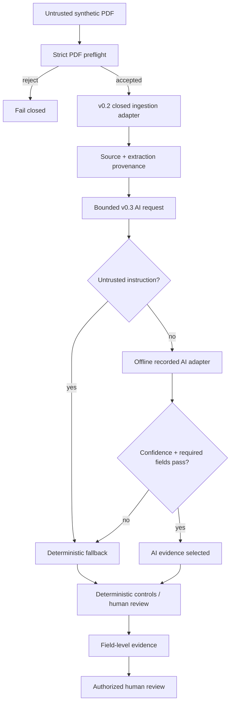

# StructuraX

[](https://github.com/bilgekayali/structurax/actions/workflows/ci.yml)


[](LICENSE)
[](DATA_LICENSE.md)

StructuraX is an open-source foundation for trustworthy, AI-assisted construction
document workflows. It detects inconsistencies, risk signals, embedded instructions and
approval gaps across quotes, purchase orders, delivery notes and invoices.

**v0.3** adds a fail-closed probabilistic extraction boundary on top of the v0.2
sandboxed-ingestion layer: provider-neutral AI adapter contracts, exact request/provenance
binding, offline recorded-response replay, prompt-injection prechecks, confidence-based
abstention, deterministic fallback and synthetic adapter comparison.

> [!IMPORTANT]
> Every committed document, AI response and benchmark label is synthetic. The built-in
> v0.3 AI adapter is offline recorded replay: it makes no network request, invokes no
> external model or tool, launches no subprocess and performs no operational side effect.
> Even an `ai_selected` result requires human review and carries no automation authority.
> StructuraX does not claim production fraud detection, document authenticity, legal or
> engineering truth, or vendor/model performance.

## Trust flow



## Current deterministic controls

| Control | Example signal |
|---|---|
| Arithmetic | Quantity × unit price, subtotal, tax or total does not reconcile |
| Currency | Invoice currency differs from purchase order |
| Price variance | Invoice unit price exceeds configured tolerance |
| Delivery reconciliation | Billed quantity exceeds recorded delivery |
| Payment-detail integrity | Invoice bank account differs from approved baseline |
| Duplicate detection | Supplier/reference/currency/total tuple repeats |
| Approval governance | Required high-value approval role is missing |
| Document-content security | Embedded control-bypass instruction appears in text |

## v0.2 ingestion boundary

The core preflight rejects empty/oversized/non-PDF/truncated inputs and selected
active/opaque PDF markers before any ingestion adapter is invoked. Accepted bytes are
bound to SHA-256. Adapter identity/configuration and extraction output receive separate
canonical digests in the resulting `IngestionArtifact`.

The built-in `RecordedExtractionAdapter` only replays committed extraction responses when
the exact source digest matches. This allows adversarial ingestion tests with no OCR API,
model credential or live parser dependency.

Verify the committed fixture chain:

```bash
structurax verify-fixtures \
  --root . \
  --manifest datasets/ingestion/manifest.json \
  --signature datasets/ingestion/manifest.sig \
  --public-key datasets/ingestion/manifest.pub
```

Exercise deterministic ingestion:

```bash
structurax ingest \
  --source datasets/ingestion/clean-invoice.pdf \
  --recordings datasets/ingestion/recorded_extractions.json \
  --output reports/local-ingestion.json
```

## v0.3 AI adapter boundary

`AIExtractionRequest` is bound to exact source and v0.2 extraction digests, bounded page
text and a canonical requested-field list. Returned fields outside that list fail closed.
The accepted core execution profile requires network, tool, subprocess and filesystem
write access to remain disabled.

Before any adapter invocation, document text is scanned for configured control-bypass
indicators. A match selects the exact deterministic fallback artifact without invoking the
AI adapter. Otherwise, overall confidence, required fields and per-field confidence are
checked. Failure at any threshold also selects the deterministic fallback.

A successful AI selection still carries:

```text
requires_human_review = true
automation_authority = false
operational_side_effects_performed = false
```

Exercise one synthetic case:

```bash
structurax ai-replay \
  --cases datasets/ai/benchmark_cases.json \
  --case-id clean-invoice \
  --recordings datasets/ai/recorded_adapter_a.json \
  --output reports/local-ai-resolution.json
```

Compare the two synthetic recorded adapters:

```bash
structurax ai-benchmark \
  --cases datasets/ai/benchmark_cases.json \
  --recordings datasets/ai/recorded_adapter_a.json \
  --recordings datasets/ai/recorded_adapter_b.json \
  --output reports/local-ai-benchmark.json
```

See [AI adapter boundary](docs/AI_ADAPTERS.md), [v0.2 fixture data lineage](docs/DATA_LINEAGE.md),
[Architecture](docs/ARCHITECTURE.md) and [Threat model](docs/THREAT_MODEL.md).

## Reviewer explanations and feedback

Every current deterministic rule ID has English and Turkish reviewer text:

```bash
structurax explain --rule-id BANK_ACCOUNT_CHANGE --language tr
```

`HumanReviewFeedback` records `confirmed`, `false_positive` or `uncertain` outcomes with
source-report binding and a stable digest. Recording feedback explicitly performs no
operational side effect.

## Evaluation evidence

`reports/evaluation/v0.2-rule-metrics.json` contains deterministic rule-family regression
evidence. `reports/evaluation/v0.3-ai-adapters.json` compares the committed synthetic AI
replay adapters by exact field accuracy, evidence fidelity, fallback/invocation counts,
recorded latency and recorded cost.

The v0.3 provider/model names are synthetic labels. These reports are reproducibility and
control-boundary evidence, not production or vendor performance claims.

## Existing normalized-pack workflow

```bash
python -m venv .venv
source .venv/bin/activate
python -m pip install -e .

structurax validate --pack datasets/demo/clean_pack.json
structurax analyze \
  --pack datasets/demo/risky_pack.json \
  --policy configs/default_policy.json \
  --output-dir reports/local-risky
```

The local Gradio demo remains credential-free:

```bash
python -m pip install -e '.[demo]'
python app.py
```

## Reproducible artifacts

```bash
python scripts/build_ai_fixtures.py
python scripts/generate_schema.py
python scripts/build_demo_reports.py
python scripts/evaluate_rule_cases.py
python scripts/evaluate_ai_adapters.py
python -m unittest discover -s tests -v
```

CI runs on Python 3.11/3.12/3.13, verifies the signed v0.2 fixture set, exercises recorded
PDF ingestion and v0.3 AI replay, regenerates synthetic AI fixtures, schemas, reports and
metrics, and fails on stale committed evidence.

## Scope and limitations

StructuraX v0.3 still does not authenticate parties, validate digital signatures, perform
live OCR, call a live LLM/provider, prove PDF malware absence, approve/pay documents,
mutate ERP data, or determine contractual/legal/engineering truth. Lexical injection
indicators are a bounded regression control, not a complete prompt-injection defense.
Live parser/OCR/model workers remain separately operated, least-privileged deployment
boundaries outside the built-in reference path.

See [Roadmap](docs/ROADMAP.md).

## License and citation

Code is licensed under Apache License 2.0. Bundled synthetic datasets are licensed under
CC BY 4.0. Citation metadata is in `CITATION.cff`.

Created and maintained by **Bilge Kayalı**.
