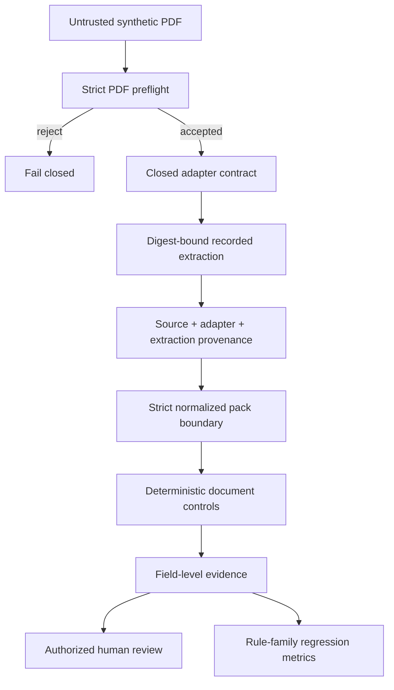

# StructuraX

[](https://github.com/bilgekayali/structurax/actions/workflows/ci.yml)


[](LICENSE)
[](DATA_LICENSE.md)

StructuraX is an open-source foundation for trustworthy, AI-assisted construction
document workflows. It detects inconsistencies, risk signals, embedded instructions and
approval gaps across quotes, purchase orders, delivery notes and invoices.

**v0.2** adds a fail-closed ingestion/evaluation boundary ahead of future OCR and AI:
strict PDF preflight, a closed adapter contract, source/extraction provenance, signed
synthetic fixtures, bilingual reviewer explanations, rule-family regression metrics and
side-effect-free human-review feedback.

> [!IMPORTANT]
> Every committed document and label is synthetic. The built-in v0.2 adapter is a
> digest-bound recorded replay adapter: it makes no network request, launches no
> subprocess, writes no source document and calls no external model. It is not a live OCR
> engine and does not prove OS/container sandbox enforcement. Findings remain review
> signals—not fraud determinations, payment decisions, legal advice or engineering advice.

## Trust flow



## Current deterministic controls

| Control | Example signal |
|---|---|
| Arithmetic | Quantity × unit price, subtotal, tax or total does not reconcile |
| Currency | Invoice currency differs from purchase order |
| Price variance | Invoice unit price exceeds configured tolerance |
| Delivery reconciliation | Billed quantity exceeds recorded delivery |
| Payment-detail integrity | Invoice bank account differs from approved baseline |
| Duplicate detection | Supplier/reference/currency/total tuple repeats |
| Approval governance | Required high-value approval role is missing |
| Document-content security | Embedded control-bypass instruction appears in text |

## v0.2 ingestion boundary

The core preflight rejects empty/oversized/non-PDF/truncated inputs and selected
active/opaque PDF markers before any adapter is invoked. Accepted bytes are bound to
SHA-256. Adapter identity/configuration and extraction output receive separate canonical
digests in the resulting `IngestionArtifact`.

The built-in `RecordedExtractionAdapter` only replays committed extraction responses when
the exact source digest matches. This allows adversarial ingestion tests with no OCR API,
model credential or live parser dependency.

Verify the committed fixture chain:

```bash
structurax verify-fixtures \
  --root . \
  --manifest datasets/ingestion/manifest.json \
  --signature datasets/ingestion/manifest.sig \
  --public-key datasets/ingestion/manifest.pub
```

Exercise deterministic ingestion:

```bash
structurax ingest \
  --source datasets/ingestion/clean-invoice.pdf \
  --recordings datasets/ingestion/recorded_extractions.json \
  --output reports/local-ingestion.json
```

See [v0.2 fixture data lineage](docs/DATA_LINEAGE.md), [Architecture](docs/ARCHITECTURE.md)
and [Threat model](docs/THREAT_MODEL.md).

## Reviewer explanations and feedback

Every current rule ID has deterministic English and Turkish reviewer text:

```bash
structurax explain --rule-id BANK_ACCOUNT_CHANGE --language tr
```

`HumanReviewFeedback` records `confirmed`, `false_positive` or `uncertain` outcomes with
source-report binding and a stable digest. Recording feedback explicitly performs no
operational side effect.

## Evaluation evidence

`datasets/evaluation/rule_cases.json` contains synthetic expected rule labels for the
committed clean/risky packs. `scripts/evaluate_rule_cases.py` runs the actual deterministic
engine and produces `reports/evaluation/v0.2-rule-metrics.json`, including false-positive,
false-negative, precision and recall counts by rule family.

These metrics are regression evidence for the committed synthetic corpus only. They are
not production fraud-detection accuracy claims.

## Existing normalized-pack workflow

```bash
python -m venv .venv
source .venv/bin/activate
python -m pip install -e .

structurax validate --pack datasets/demo/clean_pack.json
structurax analyze \
  --pack datasets/demo/risky_pack.json \
  --policy configs/default_policy.json \
  --output-dir reports/local-risky
```

The local Gradio demo remains credential-free:

```bash
python -m pip install -e '.[demo]'
python app.py
```

## Reproducible artifacts

```bash
python scripts/generate_schema.py
python scripts/build_demo_reports.py
python scripts/evaluate_rule_cases.py
python -m unittest discover -s tests -v
```

CI runs on Python 3.11/3.12/3.13, verifies the signed v0.2 fixture set, exercises the
recorded ingestion boundary, regenerates schemas/reports/metrics and fails on stale
committed evidence.

## Scope and limitations

StructuraX v0.2 still does not authenticate parties, validate digital signatures, perform
live OCR, call an LLM, prove PDF malware absence, approve/pay documents, mutate ERP data,
or determine contractual/legal/engineering truth. A future live parser/OCR worker must be
separately sandboxed and least-privileged; v0.3 will add optional provider-neutral AI
adapters behind the same deterministic trust boundary.

See [Roadmap](docs/ROADMAP.md).

## License and citation

Code is licensed under Apache License 2.0. Bundled synthetic datasets are licensed under
CC BY 4.0. Citation metadata is in `CITATION.cff`.

Created and maintained by **Bilge Kayalı**.
