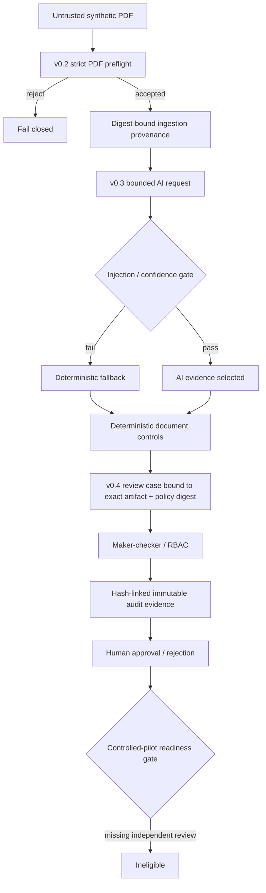

# StructuraX

[](https://github.com/bilgekayali/structurax/actions/workflows/ci.yml)


[](LICENSE)
[](DATA_LICENSE.md)

StructuraX is an open-source foundation for trustworthy, AI-assisted construction document workflows. It detects inconsistencies, risk signals, embedded instructions and approval gaps across quotes, purchase orders, delivery notes and invoices while keeping model output behind deterministic controls and explicit human authority.

**v0.4** adds a controlled-pilot governance reference above the v0.1-v0.3 trust boundaries: role-based review, maker-checker enforcement, hash-linked audit events, policy version/change governance, privacy/access/incident requirements, explicit human deployment checkpoints, rollback contracts, a synthetic red-team exercise, and a fail-closed independent-security-review gate.

> [!IMPORTANT]
> Every committed document, model response, approval event and checkpoint evidence is synthetic/reference-only. StructuraX performs no live OCR/model call, payment, ERP mutation, deployment, external notification, or autonomous approval. The committed v0.4 pilot-readiness assessment is deliberately `eligible=false` until a genuine independent security review exists for the exact repository state.

## Trust flow



## Current deterministic controls

| Control | Example signal |
|---|---|
| Arithmetic | Quantity × unit price, subtotal, tax or total does not reconcile |
| Currency | Invoice currency differs from purchase order |
| Price variance | Invoice unit price exceeds configured tolerance |
| Delivery reconciliation | Billed quantity exceeds recorded delivery |
| Payment-detail integrity | Invoice bank account differs from approved baseline |
| Duplicate detection | Supplier/reference/currency/total tuple repeats |
| Approval governance | Required high-value approval role is missing |
| Document-content security | Embedded control-bypass instruction appears in text |

## v0.2 ingestion boundary

The core preflight rejects empty, oversized, malformed/truncated and selected active/opaque PDF inputs before any adapter is invoked. Accepted source bytes, adapter identity/configuration and extraction output are bound to SHA-256 provenance. The built-in adapter is digest-bound recorded replay only.

```bash
structurax verify-fixtures \
  --root . \
  --manifest datasets/ingestion/manifest.json \
  --signature datasets/ingestion/manifest.sig \
  --public-key datasets/ingestion/manifest.pub
```

## v0.3 AI adapter boundary

The provider-neutral AI request is bound to exact source and v0.2 extraction digests. Returned fields outside the requested field set fail closed; cited-page evidence hashes and canonical response hashes are recomputed. Prompt-injection indicators can block adapter invocation entirely, and low-confidence or incomplete responses fall back deterministically.

Even a selected AI result carries:

```text
requires_human_review = true
automation_authority = false
operational_side_effects_performed = false
```

```bash
structurax ai-replay \
  --cases datasets/ai/benchmark_cases.json \
  --case-id clean-invoice \
  --recordings datasets/ai/recorded_adapter_a.json \
  --output reports/local-ai-resolution.json
```

## v0.4 controlled review workflow

A `ReviewCase` binds one exact evidence artifact digest to one exact `WorkflowPolicy` digest. Workflow transitions are role-gated. The case creator may submit/resubmit/cancel but cannot approve their own case. If a policy specifies approval owners, another approver with the same role still cannot approve unless their identity is explicitly owned by the policy.

Every accepted action becomes an `AuditEvent` whose digest covers the exact prior-event hash, actor, action, policy digest, timestamp and payload digest. Raw document content and operational side-effect claims are forbidden in the audit contract.

Policy replacement is also digest-bound: a new version must name a distinct human author/approver pair, a change ticket, a later effective time and the exact SHA-256 of the policy it supersedes.

See [Controlled Pilot Governance](docs/PILOT_GOVERNANCE.md).

## Pilot security / privacy / rollback reference

`configs/pilot_plan.json` is a synthetic, reference-only design requiring:

- bounded retention and no secrets/raw document text in evidence;
- default-deny access, MFA for humans, non-interactive service accounts, tenant boundaries and reviewed break-glass;
- explicit security/privacy/AI-control incident ownership;
- backup and rollback-test evidence;
- exactly four human checkpoints: business owner, privacy, security and workflow owner;
- no live model calls, no automated approval and no deployment performed by the repository.

See [Pilot Security, Privacy, and Incident Boundaries](docs/PILOT_SECURITY.md) and [Controlled Pilot Deployment Reference](docs/DEPLOYMENT_PILOT.md).

## Synthetic red-team and readiness evidence

```bash
python scripts/build_pilot_reference.py
python scripts/evaluate_pilot_controls.py
```

The deterministic red-team exercise covers audit-chain tampering, maker-checker self-approval, unauthorized approval ownership, policy substitution and the independent-review gate. The resulting `reports/evaluation/v0.4-pilot-readiness.json` remains ineligible while `security-review/v0.4-review.json` is absent.

A real independent reviewer must compute the reviewed source digest with:

```bash
python scripts/repository_review_digest.py
```

and follow [security-review/README.md](security-review/README.md). Reviewer identity, independence, findings and evidence must never be fabricated or inferred from CI/merge approval.

## Evaluation evidence

- `reports/evaluation/v0.2-rule-metrics.json`: deterministic rule-family regression metrics.
- `reports/evaluation/v0.3-ai-adapters.json`: synthetic adapter accuracy/evidence/latency/cost comparison.
- `reports/evaluation/v0.4-red-team.json`: synthetic governance red-team results.
- `reports/evaluation/v0.4-pilot-readiness.json`: fail-closed pilot gate; currently blocked on independent review.

These are reproducibility and control-boundary artefacts, not production effectiveness or regulatory-compliance claims.

## Existing normalized-pack workflow

```bash
python -m venv .venv
source .venv/bin/activate
python -m pip install -e .

structurax validate --pack datasets/demo/clean_pack.json
structurax analyze \
  --pack datasets/demo/risky_pack.json \
  --policy configs/default_policy.json \
  --output-dir reports/local-risky
```

The optional local Gradio demo remains credential-free:

```bash
python -m pip install -e '.[demo]'
python app.py
```

## Reproducible artifacts

```bash
python scripts/build_ai_fixtures.py
python scripts/build_pilot_reference.py
python scripts/generate_schema.py
python scripts/build_demo_reports.py
python scripts/evaluate_rule_cases.py
python scripts/evaluate_ai_adapters.py
python scripts/evaluate_pilot_controls.py
python -m unittest discover -s tests -v
```

CI runs on Python 3.11/3.12/3.13, verifies v0.2 signed fixtures, exercises v0.3 offline AI replay, enforces closed runtime imports for v0.3/v0.4 core, reruns v0.4 red-team/readiness gates, recomputes deterministic repository review digests, regenerates all committed machine contracts and fails on stale artifacts.

## Scope and limitations

StructuraX v0.4 does not authenticate real parties, validate legal digital signatures, perform live OCR or live LLM/provider calls, prove PDF malware absence, deploy infrastructure, prove IAM/tenant isolation, approve/pay documents, mutate ERP data, send regulatory notifications, or determine contractual/legal/engineering truth. It does not claim fraud-detection accuracy, model safety/factuality, legal compliance, certification, production fitness or supervisory acceptance.

See [Roadmap](docs/ROADMAP.md).

## License and citation

Code is licensed under Apache License 2.0. Bundled synthetic datasets are licensed under CC BY 4.0. Citation metadata is in `CITATION.cff`.

Created and maintained by **Bilge Kayalı**.
