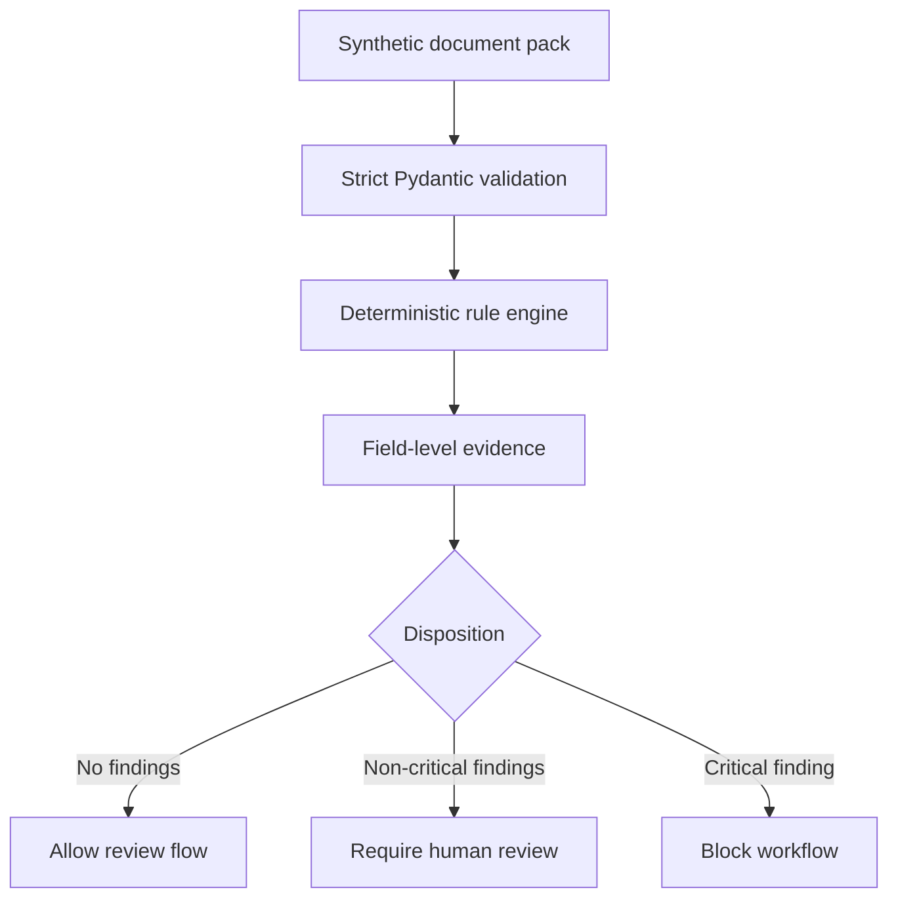

# StructuraX

[](https://github.com/bilgekayali/structurax/actions/workflows/ci.yml)


[](LICENSE)
[](DATA_LICENSE.md)

StructuraX is an open-source foundation for trustworthy, AI-assisted construction document workflows. It detects inconsistencies, risk signals, embedded instructions, and approval gaps across quotes, purchase orders, delivery notes, and invoices.

Version 0.1 deliberately starts with a deterministic trust layer. It establishes strict data contracts, evidence-backed rules, reproducible reports, and safe workflow dispositions before OCR or model adapters are introduced.

> [!IMPORTANT]
> Every bundled record is synthetic. The v0.1 loader rejects packs not marked as synthetic. Analysis uses no external model API, performs no operational action, and does not approve payments or documents. Findings are review signals—not fraud determinations, legal advice, engineering advice, or a substitute for authorized professional judgment.

## What it detects

| Control | Rule ID | Example signal |
|---|---|---|
| Line arithmetic | `ARITHMETIC_LINE_TOTAL` | Quantity × unit price differs from line total |
| Document arithmetic | `ARITHMETIC_SUBTOTAL`, `ARITHMETIC_TAX`, `ARITHMETIC_TOTAL` | Totals do not reconcile |
| Currency consistency | `CURRENCY_MISMATCH` | Invoice currency differs from purchase order |
| Price variance | `UNIT_PRICE_VARIANCE` | Invoice price exceeds the configured tolerance |
| Delivery reconciliation | `INVOICE_EXCEEDS_DELIVERY` | Billed quantity exceeds recorded delivery |
| Payment-detail integrity | `BANK_ACCOUNT_CHANGE` | Invoice bank account differs from the approved baseline |
| Duplicate detection | `DUPLICATE_INVOICE` | Supplier, reference, date, and total repeat |
| Approval governance | `MISSING_APPROVAL` | Required high-value approvals are absent |
| Document-content security | `EMBEDDED_INSTRUCTION` | Document text contains an instruction to bypass controls |

## Reference scenarios

The repository commits both input packs and their deterministic reports.

| Scenario | Documents | Result | Findings |
|---|---:|---|---:|
| Clean synthetic pack | 4 | `allow` | 0 |
| Risky synthetic pack | 5 | `block` | 13: 4 critical, 9 high |

Inspect the [clean report](reports/demo/clean-pack/report.md) and [risky report](reports/demo/risky-pack/report.md). The risky scenario contains deliberate arithmetic, delivery, price, bank-account, duplicate-invoice, approval, and embedded-instruction signals.

## Architecture



See [Architecture](docs/ARCHITECTURE.md) and [Threat model](docs/THREAT_MODEL.md) for boundaries and design decisions.

## Quick start

```bash
git clone https://github.com/bilgekayali/structurax.git
cd structurax
python -m venv .venv
source .venv/bin/activate
python -m pip install -e .
```

On Windows PowerShell, activate the environment with `.venv\\Scripts\\Activate.ps1`.

Validate a pack:

```bash
structurax validate --pack datasets/demo/clean_pack.json
```

Analyze the risky pack and write JSON and Markdown evidence reports:

```bash
structurax analyze \
  --pack datasets/demo/risky_pack.json \
  --policy configs/default_policy.json \
  --output-dir reports/local-risky
```

Run the test suite:

```bash
python -m unittest discover -s tests -v
```

## Credential-free demo

The local Gradio demo uses only the committed synthetic scenarios. It needs no API key and makes no paid model call.

```bash
python -m pip install -e '.[demo]'
python app.py
```

Or run the same demo in Docker:

```bash
docker build -t structurax .
docker run --rm -p 7860:7860 structurax
```

Then open `http://localhost:7860`.

## Reproducible artifacts

Regenerate the JSON Schema and reference reports:

```bash
python scripts/generate_schema.py
python scripts/build_demo_reports.py
```

CI reruns the tests, validates both packs, regenerates these artifacts, and fails if committed output is stale. No repository secret is required.

## Trust properties

- Strict schemas reject unknown fields and malformed document relationships.
- Decimal arithmetic avoids binary floating-point surprises in monetary controls.
- Every finding cites the relevant document and field.
- Input hashing and stable ordering make identical analyses comparable.
- Critical signals produce a `block`; other findings produce `review`.
- The engine has no payment, approval, messaging, or document-write integration.
- Model and OCR integrations remain outside the v0.1 trust boundary.

## Repository map

```text
src/structurax/       Core models, loaders, rules, engine, CLI, and reporting
configs/              Versioned deterministic policy
datasets/demo/        Synthetic clean and risky document packs
schemas/              Generated document-pack JSON Schema
reports/demo/         Reproducible reference reports
tests/                Unit, CLI, schema, report, and demo tests
docs/                 Architecture, threat model, demo guide, and roadmap
app.py                Credential-free interactive demo
```

## Scope and limitations

StructuraX v0.1 analyzes normalized JSON—not PDFs, images, signatures, or live systems. It does not authenticate parties, establish contractual truth, detect every fraud pattern, or replace accounting, compliance, legal, cybersecurity, or engineering review. See the [roadmap](docs/ROADMAP.md) for planned, sandboxed extensions.

## Contributing and security

Read [CONTRIBUTING.md](CONTRIBUTING.md) before proposing changes. Never commit real customer, supplier, employee, project, banking, or credential data. Report security issues according to [SECURITY.md](SECURITY.md).

## License and citation

Code is licensed under [Apache License 2.0](LICENSE). Bundled synthetic datasets are licensed under [CC BY 4.0](DATA_LICENSE.md). Citation metadata is available in [CITATION.cff](CITATION.cff).

Created and maintained by **Bilge Kayalı**.
