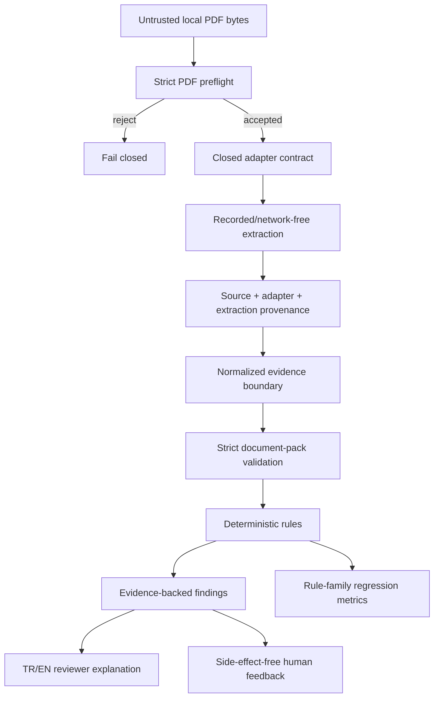

# Architecture

StructuraX v0.2 extends the deterministic v0.1 trust layer with a fail-closed ingestion
and evaluation boundary while keeping probabilistic extraction and operational actions
outside the core.

## Processing flow

## v0.2 ingestion boundary

`ingestion.py` accepts bounded local PDF bytes, validates the PDF header/terminal marker,
rejects selected active/opaque content markers and enforces maximum source/page/text
limits. It then invokes a typed adapter contract whose declared sandbox profile must keep
network, subprocess, filesystem-write and external-model access disabled.

The built-in `RecordedExtractionAdapter` performs deterministic replay keyed by the exact
source SHA-256. It does not parse PDFs, call OCR, contact a model, or execute document
content. This gives CI a safe ingestion boundary to test before a real OCR/parser worker
is introduced.

A declaration in `SandboxProfile` is an application contract, not proof of kernel,
container, VM or network enforcement. A future live parser/OCR adapter must run in a
separately enforced sandbox and still emit the same typed artifacts.

## Provenance

Every accepted ingestion artifact binds:

- exact source SHA-256 and byte length;
- source media type;
- adapter ID/version;
- canonical adapter-configuration digest; and
- canonical extraction digest.

The source document and its extracted text therefore cannot be silently substituted
without changing evidence.

## Evaluation and reviewer boundary

`evaluation.py` calculates true-positive, false-positive and false-negative counts plus
precision/recall by deterministic rule family. The committed labels are synthetic
regression evidence only.

`explanations.py` provides deterministic English/Turkish reviewer explanations for all
current rule IDs. `feedback.py` records reviewer outcomes as immutable evidence-shaped
objects and explicitly rejects any claim that recording feedback performed an
operational action.

## Fixture integrity

The v0.2 synthetic ingestion manifest is Ed25519-signed and binds exact fixture digests.
CI verifies signature and file digests before ingestion tests. See `docs/DATA_LINEAGE.md`.

## Existing deterministic core

The v0.1 `models.py`, `rules.py`, `engine.py` and reporting semantics remain unchanged:
unknown fields fail validation; monetary logic uses `Decimal`; findings retain stable rule
IDs and field evidence; and `allow/review/block` remain review dispositions rather than
authorization to pay, approve or mutate an operational record.
