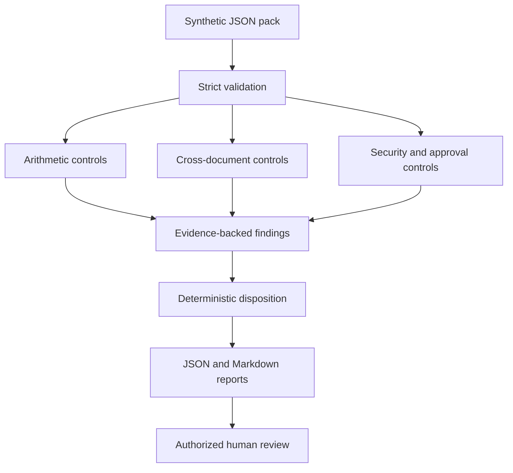

# Architecture

StructuraX v0.1 is a deterministic trust layer for normalized construction document packs. Its job is to make risk signals inspectable and reproducible before probabilistic extraction or reasoning is introduced.

## Processing flow

## Components

### Data contracts

`models.py` defines strict Pydantic models for packs, documents, line items, approvals, policy, evidence, findings, summaries, and reports. Unknown fields are rejected. Document IDs and line-item codes must be unique, and declared relationships must resolve within the pack.

The v0.1 contract requires `synthetic_data: true`. This prevents accidental treatment of the bundled foundation as a production document-processing system.

### Loader

`loader.py` reads JSON and validates it at the boundary. It does not fetch remote content, parse PDFs, invoke OCR, or persist source documents.

### Rule engine

`rules.py` contains independent deterministic control families:

- arithmetic reconciliation;
- invoice, purchase-order, and delivery-note comparison;
- duplicate-invoice detection;
- high-value approval checks; and
- embedded control-bypass instruction detection.

Monetary calculations use `Decimal`. Tolerances and approval thresholds live in a versioned policy file rather than being hidden in prompts.

### Evidence and disposition

Every finding includes a stable rule ID, severity, description, recommendation, and one or more evidence references. Evidence identifies the document, field, observed value, and expected value when applicable.

The engine assigns a disposition using a small, explicit policy:

- no findings: `allow`;
- one or more non-critical findings: `review`;
- one or more critical findings: `block`.

These states guide a review workflow. They do not approve, reject, pay, authenticate, or modify an operational record.

### Reporting

`reporting.py` writes full JSON for machines and Markdown for reviewers. The report includes an input hash, deterministic finding order, severity counts, and a safety disclaimer. Reference packs carry fixed timestamps so their committed reports can be regenerated byte for byte.

## Reproducibility

For the same validated input and policy, StructuraX produces the same input hash, finding order, evidence, and disposition. CI rebuilds the JSON Schema and reference reports, then checks that the committed artifacts remain current.

## Extension boundary

OCR, PDF parsing, classifiers, language models, retrieval, and live-system connectors are intentionally outside the deterministic core. A future adapter must be sandboxed and must emit normalized data plus provenance. Its output must pass the same strict contracts and deterministic controls before reaching a reviewer.

This boundary keeps probabilistic extraction separate from deterministic policy enforcement and makes model changes measurable rather than implicit.

