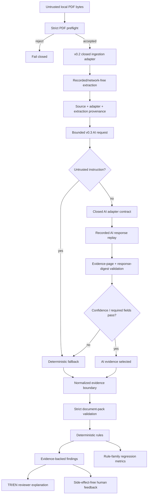

# Architecture

StructuraX v0.3 keeps the v0.1 deterministic trust layer and v0.2 fail-closed ingestion
boundary, then adds a separate probabilistic extraction boundary whose outputs remain
review evidence rather than operational authority.

## Processing flow

## v0.2 ingestion boundary

`ingestion.py` accepts bounded local PDF bytes, validates the PDF header/terminal marker,
rejects selected active/opaque content markers and enforces maximum source/page/text
limits. It then invokes a typed adapter contract whose declared sandbox profile must keep
network, subprocess, filesystem-write and external-model access disabled.

The built-in `RecordedExtractionAdapter` performs deterministic replay keyed by the exact
source SHA-256. It does not parse PDFs, call OCR, contact a model, or execute document
content.

A declaration in `SandboxProfile` is an application contract, not proof of kernel,
container, VM or network enforcement. A future live parser/OCR adapter must run in a
separately enforced sandbox and still emit the same typed artifacts.

## v0.3 probabilistic boundary

`ai_adapters.py` defines a provider-neutral `AIExtractionAdapter` protocol and a closed
`AIExecutionProfile`. The built-in `RecordedAIAdapter` is the only supplied implementation:
it resolves exact canonical request digests to committed synthetic responses.

The accepted core profile requires all of the following to remain false:

- network access;
- tool access;
- subprocess access; and
- filesystem-write access.

This is a contract checked by StructuraX and reinforced by CI source-import checks; it is
not proof that an arbitrary third-party implementation obeys its declaration. Any future
live provider connector remains a separately operated deployment boundary.

### Request and response binding

`AIExtractionRequest` binds AI extraction to exact source and v0.2 extraction SHA-256
values, bounded page text and a canonical requested-field list. The response path rejects
unrequested fields and out-of-range evidence pages.

For each predicted field, StructuraX recomputes the SHA-256 of the cited page text and
requires it to match `evidence_text_sha256`. The complete recorded response payload also
has a canonical digest that must match `provider_response_sha256`.

### Abstention and fallback

Before adapter invocation, configured control-bypass indicators are searched in untrusted
page text. A match selects the exact deterministic fallback without invoking the adapter.
If invocation is allowed, low overall confidence, missing required fields or low required
field confidence also select the fallback.

Passing these checks only selects AI evidence for review. The resulting `AIResolution`
keeps `requires_human_review=true`, `automation_authority=false` and
`operational_side_effects_performed=false`.

## Provenance

Every accepted v0.2 ingestion artifact binds source bytes, adapter configuration and
extraction output. v0.3 then binds its request to those exact source/extraction digests and
binds selected probabilistic evidence back to cited page text and the exact recorded
response payload.

## Evaluation and reviewer boundary

`evaluation.py` calculates deterministic rule-family TP/FP/FN and precision/recall.
`ai_evaluation.py` compares synthetic recorded AI adapters by exact selected-field
accuracy, evidence fidelity, fallback/invocation counts, recorded latency and recorded
cost. No live model call is performed.

`explanations.py` provides deterministic English/Turkish reviewer explanations for current
rule IDs. `feedback.py` records reviewer outcomes as immutable evidence-shaped objects and
explicitly rejects any claim that recording feedback performed an operational action.

## Fixture integrity

The v0.2 synthetic ingestion manifest is Ed25519-signed and binds exact fixture digests.
The v0.3 AI fixtures are deterministic synthetic JSON generated by
`scripts/build_ai_fixtures.py`; CI regenerates and byte-compares them. See
`docs/DATA_LINEAGE.md` and `docs/AI_ADAPTERS.md`.

## Existing deterministic core

The v0.1 `models.py`, `rules.py`, `engine.py` and reporting semantics remain unchanged:
unknown fields fail validation; monetary logic uses `Decimal`; findings retain stable rule
IDs and field evidence; and `allow/review/block` remain review dispositions rather than
authorization to pay, approve or mutate an operational record.
